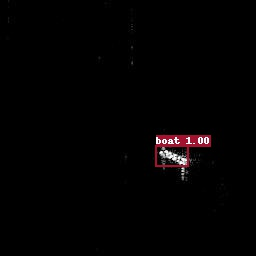
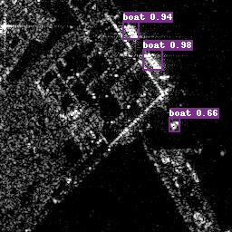

# DCIC Ships Detection
## 一、项目背景
海上船舶目标检测对于领海安全、渔业资源管理和海上运输与救援具有重要意义，但在天气和海浪等不可控的自然因素影响下，依靠派遣海警船或基于可见光数据进行船舶目标监测等手段往往难以有效开展。卫星合成孔径雷达(SAR)是一种全天时、全天候、多维度获取信息的主动式微波成像雷达，为海洋上多尺度的船舶检测提供了强有力的数据保障和技术支持，在**遥感图像**船舶检测领域占有重要地位。由于SAR的成像原理与光学相机存在很大的差别，如何利用SAR数据特性设计出一套具有针对性的船舶检测方法是一大难点。本赛题鼓励选手通过数据算法寻找这个难题的新颖解法，进一步推动海上船舶智能检测的发展。

## 二、项目任务
快速精准的检测出船舶的垂直边框是船舶智能检测的基本需求。本项目以训练数据集中船舶和相应垂直边框信息为学习依据，要求对测试数据集中的船舶进行检测（图a），求解出船舶对应垂直边框（图b）。需要考虑SAR图像和船舶目标的特性，如背景强散射杂波的不均匀性，目标的不完整性、十字旁瓣模糊和临近目标干扰等，设计科学适用的算法模型进行船舶的智能检测。


## 三、Faster RCNN理论
- **conv layers**：feature maps图像特征提取层，常用VGG、ResNet作为骨干网络。
- **Region Proposal Network**：候选框生成网络，输出proposal boxes和候选区的feature map。
- **RoI pooling**：重塑图像尺寸，固定大小输出。
- **Classifier**：类别分类和检测框回归

<center>

</center>

## 3.1 Conv Layers
目标监测任务中的骨干网络将浅层的视觉特征映射到深层的语义特征，以发现高层数据的分布式特征表示，其中最具代表性的杰作是由何恺明提出ResNet深度残差网络，在此基础上利用FPN（feature pyramid networks）进行多尺度融合，进一步提升了网络的性能。

<center>

</center>

```
ResNet:
  # index 0 stands for res2
  depth: 50
  # norm_type，可设置参数：bn 或 sync_bn
  norm_type: bn
  # freeze_at index, 0 represent res2
  freeze_at: 0
  # return_idx
  return_idx: [0,1,2,3]
  # num_stages
  num_stages: 4

FPN:
  # channel of FPN concat 4×64=256
  out_channel: 256
```

## 3.2 Region Proposal Network
Faster RCNN摒弃了传统的滑动窗口和SS方法，由RPN网络直接生成9个Anchor，极大地提升了检测框的生成速度。每个Anchor对应一个数组[$x_{1}, y_{1}, x_{2}, y_{2}$]，表示矩形的左上角和右下角坐标，其中9个Anchor又有3种形状，长宽比为{1:1, 1:2, 2:1}。

<center>

</center>

任意大小的图像reshape为800×600，骨干网络下采样1/16倍，Anchor的作用是为每一个feature maps配备初始检测框，分类网络（2k scores）判别检测框里的特征图是Positive或Negative，回归网络（4k scores）修正$(x, y , w, h)$的偏移量。

<center>

</center>

Anchor作用于feature map的每一个点，feature map上的点都生成9个anchor。

```
RPNHead:
  # anchor generator 锚框生成器
  anchor_generator:
    aspect_ratios: [0.5, 1.0, 2.0] 
    anchor_sizes: [[32], [64], [128], [256], [512]]
    strides: [4, 8, 16, 32, 64]
  # rpn_target_assign
  rpn_target_assign:
    batch_size_per_im: 256
    fg_fraction: 0.5
    negative_overlap: 0.3 #class layer 2k
    positive_overlap: 0.7 #class layer 2k
    use_random: True
  # 训练时生成proposal的参数
  train_proposal:
    min_size: 0.0
    nms_thresh: 0.7 #非极大值抑制
    pre_nms_top_n: 2000
    post_nms_top_n: 1000
    topk_after_collect: True
  # 评估时生成proposal的参数
  test_proposal:
    min_size: 0.0
    nms_thresh: 0.7 #非极大值抑制
    pre_nms_top_n: 1000
    post_nms_top_n: 1000
```

## 3.3 RoI Pooling
RPN网络输出的Proposal形状大小各异，不利于卷积神经网络的运算，在保证不破坏图像完整结构的前提下，RoI Pooling实现了固定大小7 × 7的结果输出。

<center>

</center>

```
BBoxHead:
  # TwoFCHead as BBoxHead
  head: TwoFCHead #feature map 和 region proposal
  # roi align
  roi_extractor:
    resolution: 7 #7×7大小尺寸
    sampling_ratio: 0
    aligned: True
  # bbox_assigner
  bbox_assigner: BBoxAssigner
  
BBoxAssigner:
  # batch_size_per_im
  batch_size_per_im: 512
  # 背景阈值
  bg_thresh: 0.5
  # 前景阈值
  fg_thresh: 0.5
  # 前景比例
  fg_fraction: 0.25
  # 是否随机采样
  use_random: True
  
TwoFCHead:
  # TwoFCHead特征维度
  out_channel: 1024
```

## 3.4 Classifier
Classification部分利用已经获得的proposal feature maps，通过full connect层与softmax计算每个proposal具体属于那个类别（如船舶、海面等），输出cls_prob概率向量；同时再次利用bounding box regression获得每个proposal的位置偏移量bbox_pred，用于回归更加精确的目标检测框。

<center>

</center>

**class layer**

候选框生成器会在原图上产生密密麻麻的Anchors，分类网络判断锚框下的图像是否有positive anchor，其中一个很重要的评价参数就是交并比（IoU），具体的计算公式如下：

$$
I o U=\frac{A \cap B}{A \cup B}
$$

<center>

</center>

**regression layer**

红色的框A代表原始的positive Anchors，绿色的框G代表目标的GT，我们的目标是寻找一种关系，使得输入原始的anchor A经过映射得到一个跟真实窗口G更接近的回归窗口G'。
给定anchor $A=\left(A_{x}, A_{y}, A_{w}, A_{h}\right)$ 和 $G T=\left[G_{x}, G_{y}, G_{w}, G_{h}\right]$
寻找一种变换F，使得：$F\left(A_{x}, A_{y}, A_{w}, A_{h}\right)=\left(G_{x}^{\prime}, G_{y}^{\prime}, G_{w}^{\prime}, G_{h}^{\prime}\right)$，其中$\left(G_{x}^{\prime}, G_{y}^{\prime}, G_{w}^{\prime}, G_{h}^{\prime}\right) \approx\left(G_{x}, G_{y}, G_{w}, G_{h}\right)$，预测值和真实值的偏差即为回归变量。

<center>

</center>

```
BBoxPostProcess:
  # 解码
  decode: RCNNBox
  # nms
  nms:
    # 使用MultiClassNMS
    name: MultiClassNMS
    keep_top_k: 100
    score_threshold: 0.05
    nms_threshold: 0.5
```


## 四、数据集介绍
下载链接：[https://aistudio.baidu.com/aistudio/datasetdetail/134192](https://aistudio.baidu.com/aistudio/datasetdetail/134192)

| 数据集划分 | 图片数量（张） |
| :--------: | :--------: |
| train     | 20504 |
| valid     | 1000  |
| test      | 18112 |

目录结构
```
DATASET_VOC/
├── annotations
│   ├── xxx1.xml #voc数据的标注文件
│   ├── xxx2.xml #voc数据的标注文件
│   ├── xxx3.xml #voc数据的标注文件
│   |   ...
├── images
│   ├── xxx1.jpg
│   ├── xxx2.jpg
│   ├── xxx3.jpg
│   |   ...
├── label_list.txt (必须提供，且文件名称必须是label_list.txt )
├── train.txt       (训练数据集文件列表, ./images/xxx1.jpg ./annotations/xxx1.xml)
└── valid.txt       (测试数据集文件列表)
TEST/
├── xxx1.jpg
├── xxx2.jpg
├── xxx3.jpg
```

## 五、代码实战
- 解压数据集
```
!unzip -oq data/data134192/DATASET_VOC.zip -d data/dataset
!unzip -oq data/data134192/TEST.zip -d data
```
- 安装依赖库
```
#!git clone https://gitee.com/PaddlePaddle/PaddleDetection.git

# 安装其他依赖
!pip install -r PaddleDetection/requirements.txt

# 编译安装paddledet
!cd PaddleDetection && python setup.py install
```

- 修改配置文件

替换`PaddleDetection/configs/datasets/voc.yml`和`PaddleDetection/configs/faster_rcnn/faster_rcnn_r50_1x_coco.yml`的内容，
配置文件保存在本项目的`DCIC_Ship_Detection/config`文件夹内。

- 模型训练
```
!python PaddleDetection/tools/train.py -c PaddleDetection/configs/faster_rcnn/faster_rcnn_r50_1x_coco.yml   \
        -o use_gpu=True    \
        snapshot_epoch=4   \
        --use_vdl=True
```
- 模型评估
```
!python PaddleDetection/tools/eval.py -c PaddleDetection/configs/faster_rcnn/faster_rcnn_r50_1x_coco.yml    \
        -o weights='output/faster_rcnn_r50_1x_coco/model_final'
```
- 模型预测
```
!python PaddleDetection/tools/infer.py -c PaddleDetection/configs/faster_rcnn/faster_rcnn_r50_1x_coco.yml   \
        --infer_dir='data/test_dataset/'     \
        --output_dir='infer_output/'         \
        --save_txt=True         \
        --draw_threshold=0.7    \
        -o weights='output/faster_rcnn_r50_1x_coco/model_final'
```

## 六、结果及分析
- 模型评估

epoch=4：mAP=84.97%，FPS=4.95。

epoch=8：mAP=86.73%，FPS=4.79.

- 模型预测





- 模型提升

Faster RCNN的作者在论文中提到："A similar alternating training can be run for more iterations, but we have observed negligible improvements"，即循环更多次精度没有提升了。这是因为Faster RCNN在模型搭建阶段使用的卷积层比较少，可学习参数经过少数几次迭代即可收敛，在模型预测阶段阈值的设定界限直接影响bounding box的生成。

1. 模型结构：backbone选取resnet101_vd_fpn_ssld_2x，参考PaddleClas套件
2. 数据增强：RandomResize、AutoAugment、Mixup等
3. 分批预测：测试集图像分组预测，draw_threshold=[0.5, 0.6, 0.7, 0.8]
